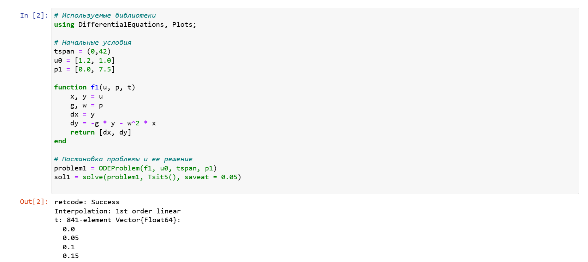
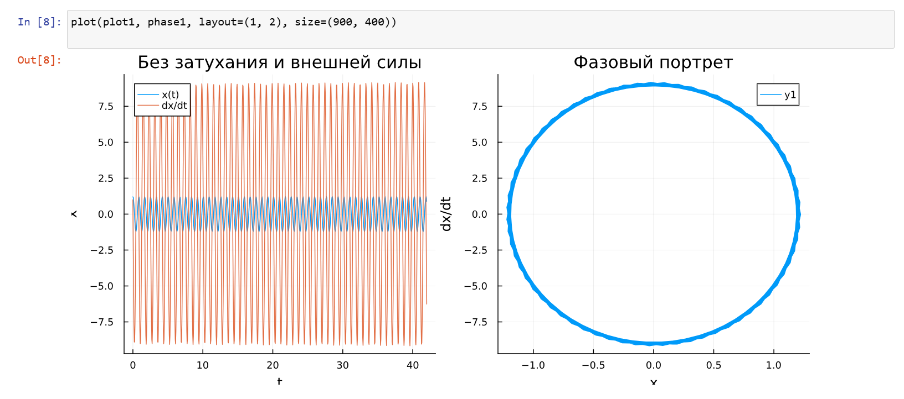
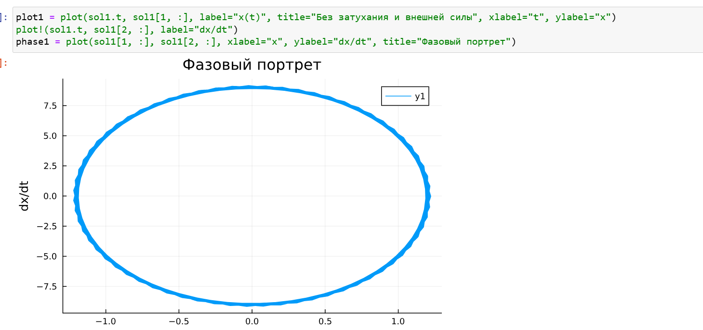
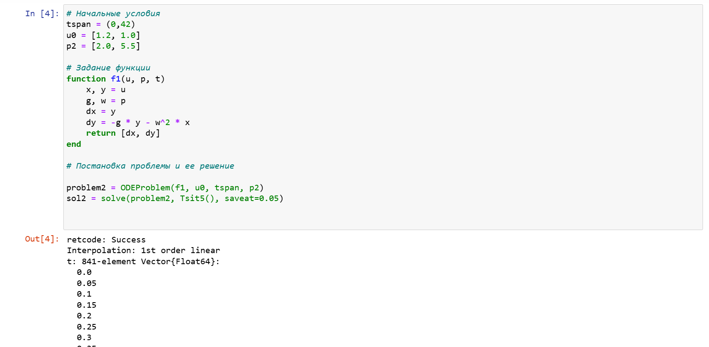
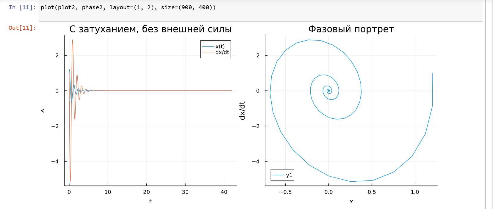
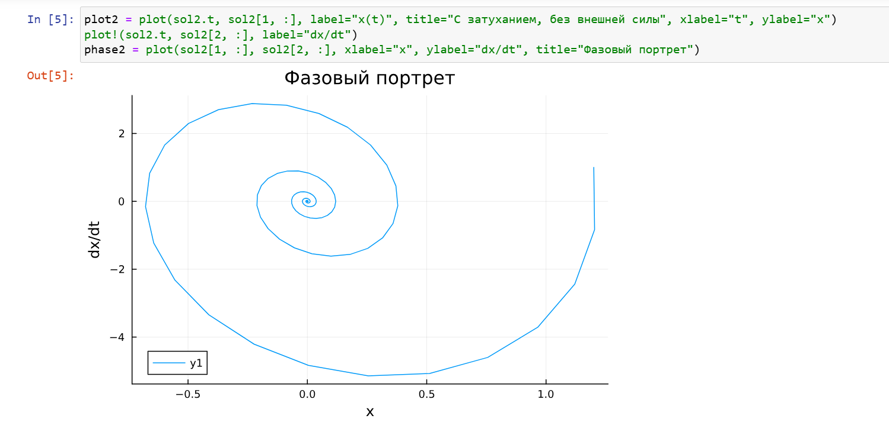
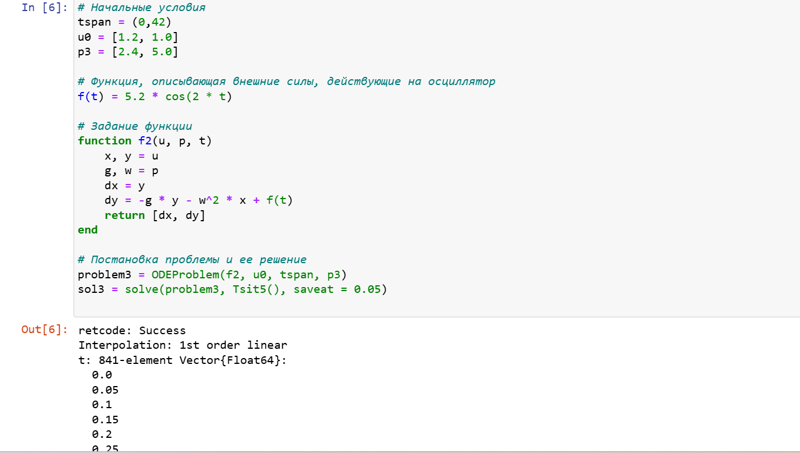
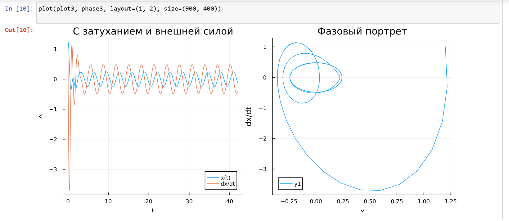
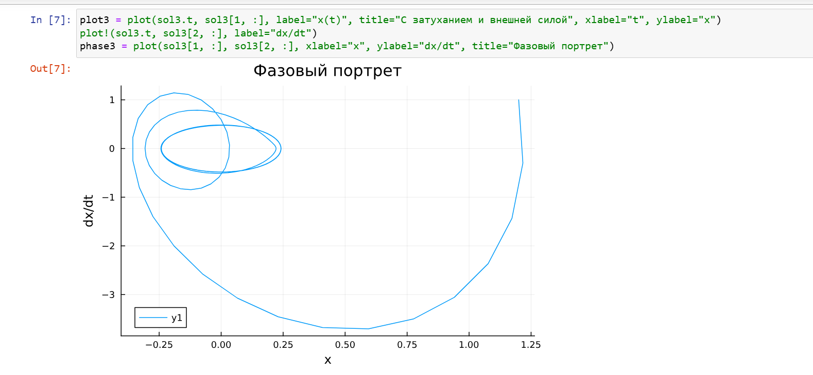

---
## Front matter
title: "Лабораторная работа № 4"
subtitle: "Модель гармонических колебаний"
author: "Хамдамова Айжана"

## Generic otions
lang: ru-RU
toc-title: "Содержание"

## Bibliography
bibliography: bib/cite.bib
csl: pandoc/csl/gost-r-7-0-5-2008-numeric.csl

## Pdf output format
toc: true # Table of contents
toc-depth: 2
lof: true # List of figures
lot: true # List of tables
fontsize: 12pt
linestretch: 1.5
papersize: a4
documentclass: scrreprt
## I18n polyglossia
polyglossia-lang:
  name: russian
  options:
	- spelling=modern
	- babelshorthands=true
polyglossia-otherlangs:
  name: english
## I18n babel
babel-lang: russian
babel-otherlangs: english
## Fonts
mainfont: IBM Plex Serif
romanfont: IBM Plex Serif
sansfont: IBM Plex Sans
monofont: IBM Plex Mono
mathfont: STIX Two Math
mainfontoptions: Ligatures=Common,Ligatures=TeX,Scale=0.94
romanfontoptions: Ligatures=Common,Ligatures=TeX,Scale=0.94
sansfontoptions: Ligatures=Common,Ligatures=TeX,Scale=MatchLowercase,Scale=0.94
monofontoptions: Scale=MatchLowercase,Scale=0.94,FakeStretch=0.9
mathfontoptions:
## Biblatex
biblatex: true
biblio-style: "gost-numeric"
biblatexoptions:
  - parentracker=true
  - backend=biber
  - hyperref=auto
  - language=auto
  - autolang=other*
  - citestyle=gost-numeric
## Pandoc-crossref LaTeX customization
figureTitle: "Рис."
tableTitle: "Таблица"
listingTitle: "Листинг"
lofTitle: "Список иллюстраций"
lotTitle: "Список таблиц"
lolTitle: "Листинги"
## Misc options
indent: true
header-includes:
  - \usepackage{indentfirst}
  - \usepackage{float} # keep figures where there are in the text
  - \floatplacement{figure}{H} # keep figures where there are in the text
---

# Цель работы

Построить математическую модель гармонического осциллятора.

# Задание

Вариант 40  
Постройте фазовый портрет гармонического осциллятора и решение уравнения
гармонического осциллятора для следующих случаев
1. Колебания гармонического осциллятора без затуханий и без действий внешней силы
$$\ddot{x} +7.5x = 0,$$

2. Колебания гармонического осциллятора c затуханием и без действий внешней силы

 $$\ddot x + 2\dot x + 5.5 x = 0,$$
 
3. Колебания гармонического осциллятора c затуханием и под действием внешней силы

 $$\ddot x + 2.4 \dot x + 5 x = 5.2 sin(2t).$$

На интервале $t \in [0; 42]$ (шаг 0.05) с начальными условиями $x_0 = 1.2, \,\, y_0=1.$

# Теоретическое введение

Гармонические колебания — колебания, при которых физическая величина изменяется с течением времени по гармоническому (синусоидальному, косинусоидальному) закону.

Уравнение гармонического колебания имеет вид

$$x(t)=A\sin(\omega t+\varphi _{0})$$

или

$$x(t)=A\cos(\omega t+\varphi _{0}),$$ 

где $x$ — отклонение колеблющейся величины в текущий момент времени $t$ от среднего за период значения (например, в кинематике — смещение, отклонение колеблющейся точки от положения равновесия);
$A$ — амплитуда колебания, то есть максимальное за период отклонение колеблющейся величины от среднего за период значения, размерность 
$A$ совпадает с размерностью $x$;
$\omega$ (радиан/с, градус/с) — циклическая частота, показывающая, на сколько радиан (градусов) изменяется фаза колебания за 1 с;

$(\omega t+\varphi _{0})=\varphi$ (радиан, градус) — полная фаза колебания (сокращённо — фаза, не путать с начальной фазой);

$\varphi _{0}$ (радиан, градус) — начальная фаза колебаний, которая определяет значение полной фазы колебания (и самой величины $x$) в момент времени $t=0$.
Дифференциальное уравнение, описывающее гармонические колебания, имеет вид

$$\frac {d^{2}x}{dt^{2}}+\omega ^{2}x=0.$$

[@wiki_bash].

# Выполнение лабораторной работы

Модель колебаний гармонического осциллятора без затуханий и без действий внешней силы

Реализуем на языке Julia (рис. [-@fig:010]).

{#fig:010 width=70%}

В результате получаем следующие графики решения уравнения
гармонического осциллятора  (рис. [-@fig:001]) и его фазового портрета  (рис. [-@fig:002]).

{#fig:001 width=70%}

{#fig:002 width=70%}

Можно заметить, что колебание осциллятора периодично, график не задухает.

Модель колебаний гармонического осциллятора c затуханием и без действий внешней силы (рис. [-@fig:010])

{#fig:011 width=70%}

В результате получаем следующие графики решения уравнения
гармонического осциллятора  (рис. [-@fig:005]) и его фазового портрета  (рис. [-@fig:006]).

{#fig:005 width=70%}

{#fig:006 width=70%}

В этом случае сначала происходят колебания осциллятора, а затем график затухает, поскольку у нас есть параметр, отвечающий за потери энергии.

Модель колебаний гармонического осциллятора c затуханием и под действием внешней силы(рис. [-@fig:012])

{#fig:012 width=70%}

В результате получаем следующие графики решения уравнения
гармонического осциллятора  (рис. [-@fig:009]) и его фазового портрета  (рис. [-@fig:010]).

{#fig:009 width=70%}

{#fig:010 width=70%}

# Выводы

В процессе выполнения данной лабораторной работы я построила математическую модель гармонического осциллятора.

