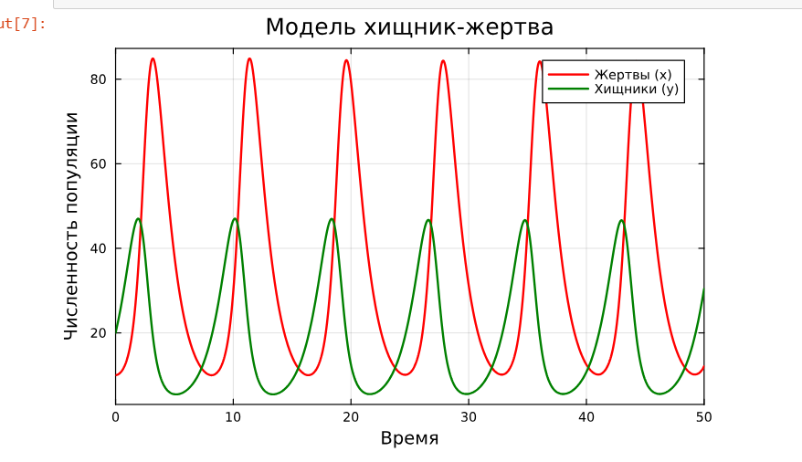
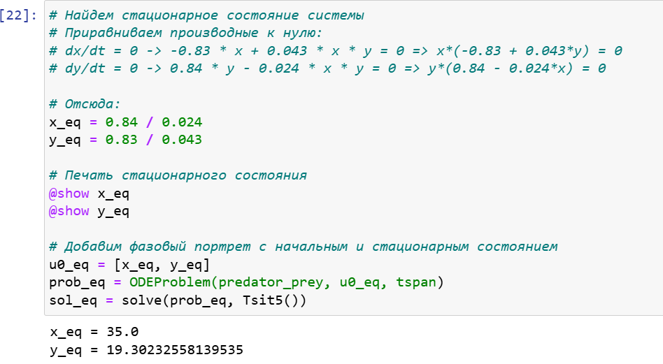

---
## Front matter
lang: ru-RU
title: Лабораторная работа № 5
subtitle: Модель хищник-жертва
author:
  - Хамдамова Айжана
institute:
  - Российский университет дружбы народов, Москва, Россия
date: 6 апреля 2025

## i18n babel
babel-lang: russian
babel-otherlangs: english

## Formatting pdf
toc: false
toc-title: Содержание
slide_level: 2
aspectratio: 169
section-titles: true
theme: metropolis
header-includes:
 - \metroset{progressbar=frametitle,sectionpage=progressbar,numbering=fraction}
---

# Информация

## Докладчик

* Хамдамова Айжана
* студент факультета Физико-математических и естественных наук
* Российский университет дружбы народов
* 1032225989@pfur.ru
* https://github.com/AizhanaKhamdamova/study_2024-2025_mathmod

## Цель работы

Исследовать математическую модель Лотки-Вольерры.

## Задание

Для модели «хищник-жертва»:

$$\begin{cases}
    &\dfrac{dx}{dt} = - 0.83 x(t) + 0.043 x(t)y(t) \\
    &\dfrac{dy}{dt} = 0.84 y(t) - 0.024 x(t)y(t)
\end{cases}$$

Построить график зависимости численности хищников от численности жертв,
а также графики изменения численности хищников и численности жертв при
следующих начальных условиях:
$x_0 = 10, y_0 = 20.$ 
Найти стационарное состояние системы.

## Теоретическое введение

Моде́ль Ло́тки — Вольте́рры (модель Ло́тки — Вольтерра́[1]) — модель взаимодействия двух видов типа «хищник — жертва», названная в честь своих авторов (Лотка, 1925; Вольтерра 1926), которые предложили модельные уравнения независимо друг от друга.

Такие уравнения можно использовать для моделирования систем «хищник — жертва», «паразит — хозяин», конкуренции и других видов взаимодействия между двумя видами[2].

В математической форме предложенная система имеет следующий вид:

$$\begin{cases}
    &\dfrac{dx}{dt} = \alpha x(t) - \beta x(t)y(t) \\
    &\dfrac{dy}{dt} = -\gamma y(t) + \delta x(t)y(t)
\end{cases}$$

где 
$\displaystyle x$ — количество жертв, 

$\displaystyle y$ — количество хищников, 

${\displaystyle t}$ — время, 

${\displaystyle \alpha ,\beta ,\gamma ,\delta }$ — коэффициенты, отражающие взаимодействия между видами.

## Выполнение лабораторной работы

## Ход работы

## Ход работы

## Ход работы

## Ход работы

