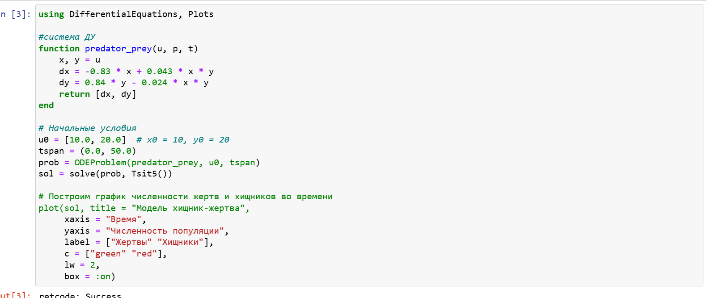
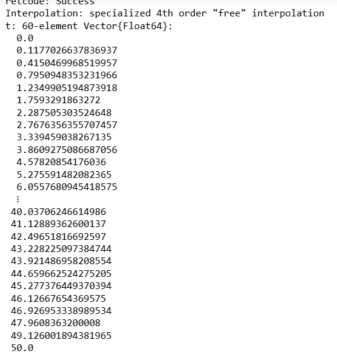
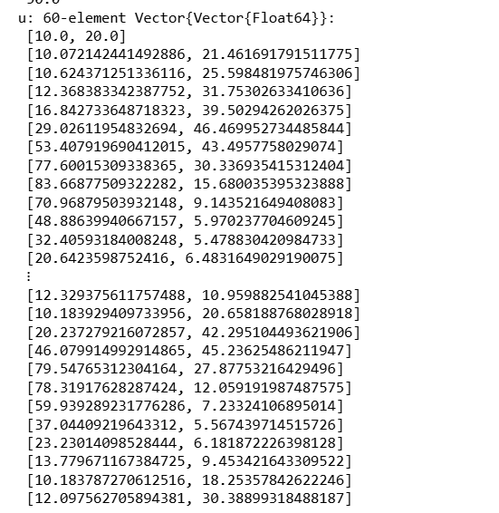
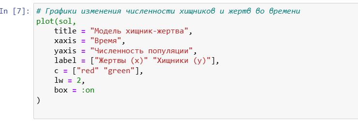
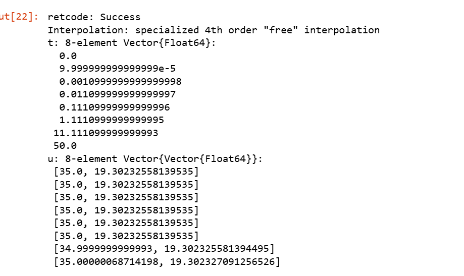
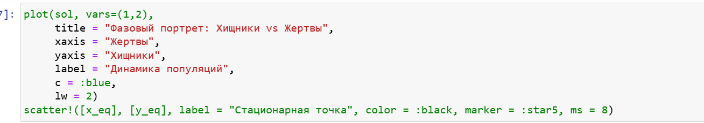
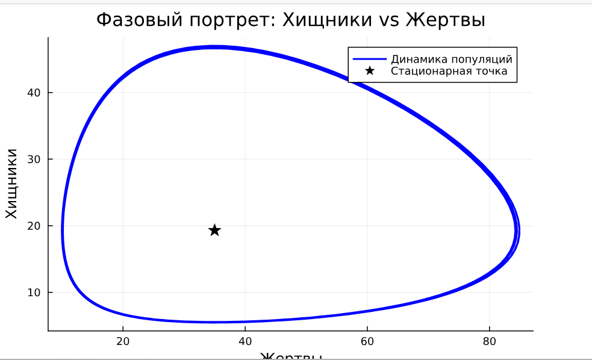

---
## Front matter
title: "Лабораторная работа № 5"
subtitle: "Модель хищник-жертва"
author: "Хамдамова Айжана"

## Generic otions
lang: ru-RU
toc-title: "Содержание"

## Bibliography
bibliography: bib/cite.bib
csl: pandoc/csl/gost-r-7-0-5-2008-numeric.csl

## Pdf output format
toc: true # Table of contents
toc-depth: 2
lof: true # List of figures
lot: true # List of tables
fontsize: 12pt
linestretch: 1.5
papersize: a4
documentclass: scrreprt
## I18n polyglossia
polyglossia-lang:
  name: russian
  options:
	- spelling=modern
	- babelshorthands=true
polyglossia-otherlangs:
  name: english
## I18n babel
babel-lang: russian
babel-otherlangs: english
## Fonts
mainfont: IBM Plex Serif
romanfont: IBM Plex Serif
sansfont: IBM Plex Sans
monofont: IBM Plex Mono
mathfont: STIX Two Math
mainfontoptions: Ligatures=Common,Ligatures=TeX,Scale=0.94
romanfontoptions: Ligatures=Common,Ligatures=TeX,Scale=0.94
sansfontoptions: Ligatures=Common,Ligatures=TeX,Scale=MatchLowercase,Scale=0.94
monofontoptions: Scale=MatchLowercase,Scale=0.94,FakeStretch=0.9
mathfontoptions:
## Biblatex
biblatex: true
biblio-style: "gost-numeric"
biblatexoptions:
  - parentracker=true
  - backend=biber
  - hyperref=auto
  - language=auto
  - autolang=other*
  - citestyle=gost-numeric
## Pandoc-crossref LaTeX customization
figureTitle: "Рис."
tableTitle: "Таблица"
listingTitle: "Листинг"
lofTitle: "Список иллюстраций"
lotTitle: "Список таблиц"
lolTitle: "Листинги"
## Misc options
indent: true
header-includes:
  - \usepackage{indentfirst}
  - \usepackage{float} # keep figures where there are in the text
  - \floatplacement{figure}{H} # keep figures where there are in the text
---

# Цель работы

Исследовать математическую модель Лотки-Вольерры.

# Задание

Для модели «хищник-жертва»:

$$\begin{cases}
    &\dfrac{dx}{dt} = - 0.83 x(t) + 0.043 x(t)y(t) \\
    &\dfrac{dy}{dt} = 0.84 y(t) - 0.024 x(t)y(t)
\end{cases}$$

Построить график зависимости численности хищников от численности жертв,
а также графики изменения численности хищников и численности жертв при
следующих начальных условиях:
$x_0 = 10, y_0 = 20.$ 
Найти стационарное состояние системы.

# Теоретическое введение

Моде́ль Ло́тки — Вольте́рры (модель Ло́тки — Вольтерра́[1]) — модель взаимодействия двух видов типа «хищник — жертва», названная в честь своих авторов (Лотка, 1925; Вольтерра 1926), которые предложили модельные уравнения независимо друг от друга.

Такие уравнения можно использовать для моделирования систем «хищник — жертва», «паразит — хозяин», конкуренции и других видов взаимодействия между двумя видами[2].

В математической форме предложенная система имеет следующий вид:

$$\begin{cases}
    &\dfrac{dx}{dt} = \alpha x(t) - \beta x(t)y(t) \\
    &\dfrac{dy}{dt} = -\gamma y(t) + \delta x(t)y(t)
\end{cases}$$

где 
$\displaystyle x$ — количество жертв, 

$\displaystyle y$ — количество хищников, 

${\displaystyle t}$ — время, 

${\displaystyle \alpha ,\beta ,\gamma ,\delta }$ — коэффициенты, отражающие взаимодействия между видами.

# Выполнение лабораторной работы

Для того, чтобы построить графики нам нужно сначала решить систему ДУ. Для этого мы используем язык программирования Julia и ПО OpenModelica, затем сравним результат.

## Реализация на Julia  

Напишем код для решения системы ДУ, используя библиотеку `DifferentialEquations.jl`, а затем построим графики с помощью библиотеки `Plots`.(рис. [-@fig:001])

{#fig:001 width=70%}

Далее найдем стационарное состояние системы по формуле:

В результате получаем следующие графики изменения численности хищников и численности жертв (рис. [-@fig:009]) и зависимости численности хищников от численности жертв (рис. [-@fig:010]).

{#fig:009 width=70%}

{#fig:010 width=70%}

Графики периодичны, фазовый портрет замкнут, как и должно быть в жесткой модели Лотки-Вольтерры.

# Выводы

В результате выполнения лабораторной работы я построила математическую модель Лотки-Вольтерры.