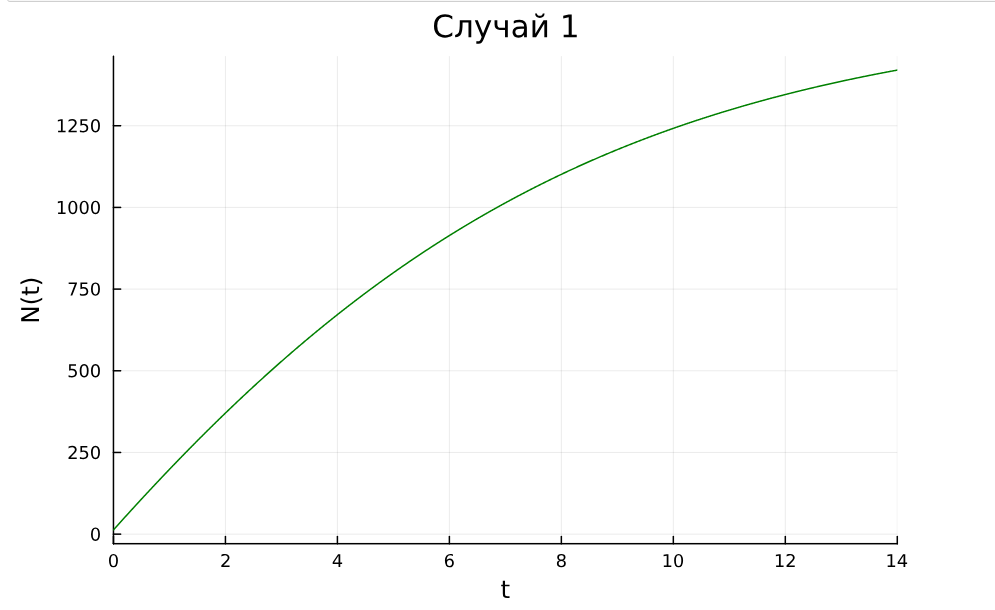
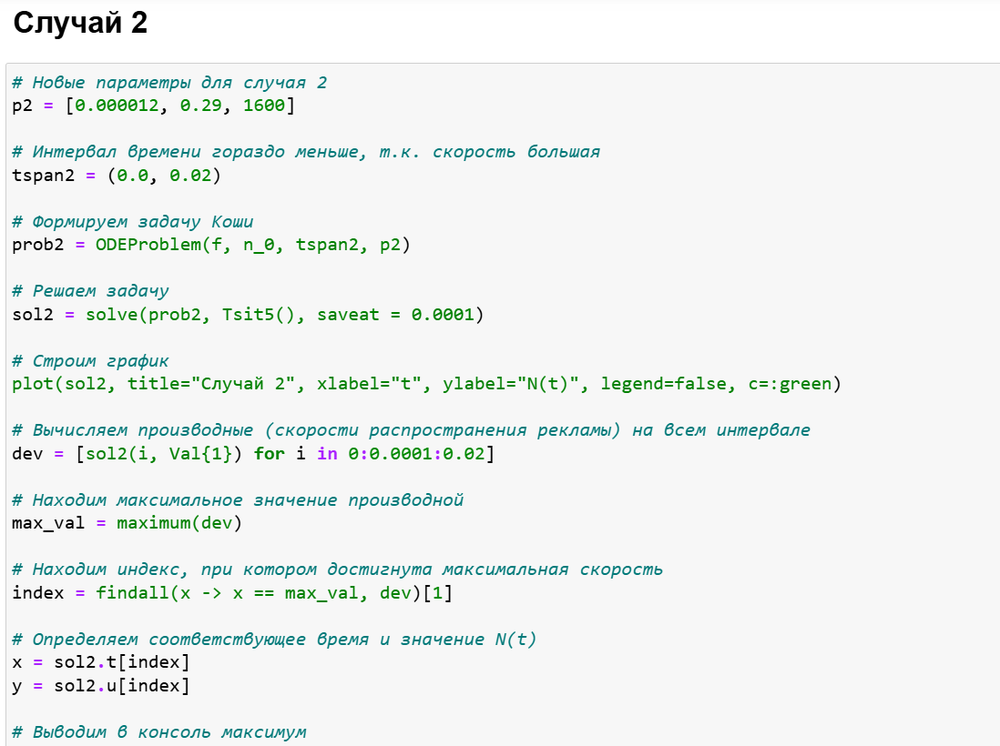

---
## Front matter
lang: ru-RU
title: Лабораторная работа № 7
subtitle: Эффективность рекламы
author:
  - Хамдамова Айжана
institute:
  - Российский университет дружбы народов, Москва, Россия
date: 12 апреля 2025

## i18n babel
babel-lang: russian
babel-otherlangs: english

## Formatting pdf
toc: false
toc-title: Содержание
slide_level: 2
aspectratio: 169
section-titles: true
theme: metropolis
header-includes:
 - \metroset{progressbar=frametitle,sectionpage=progressbar,numbering=fraction}
---

# Информация

## Докладчик

* Хамдамова Айжана
* студент факультета Физико-математических и естественных наук
* Российский университет дружбы народов
* 1032225989@pfur.ru
* https://github.com/AizhanaKhamdamova/study_2024-2025_mathmod

# Вводная часть

## Теоретическое введение

Пусть некая фирма начинает рекламировать новый товар. Необходимо, чтобы прибыль от будущих продаж покрывала издержки на дорогостоящую кампанию. Ясно, что вначале расходы могут превышать прибыль, поскольку лишь малая часть потенциальных покупателей будет информирована о новом товаре. Затем, при увеличении числа продаж, уже возможно рассчитывать на заметную прибыль, и, наконец, наступит момент, когда рынок насытится, и рекламировать товар далее станет бессмысленно.

Модель рекламной кампании основывается на следующих основных предположениях. Считается, что величина $\dfrac{dN}{dt}$ — скорость изменения со временем числа потребителей, узнавших о товаре и готовых купить его ($t$ — время, прошедшее с начала рекламной кампании, $N(t)$ – число уже информированных клиентов), — пропорциональна числу покупателей, еще не знающих о нем, т. е. величине $\alpha_1(t)(N_0 - N(t))$, где $N_0$ - общее число покупателей (емкость рынка),характеризует интенсивность рекламной кампании. Предполагается также, что узнавшие о товаре потребители распространяют полученную информацию среди неосведомленных, выступая как бы в роли дополнительных рекламных агентов фирмы. Их вклад равен величине $\alpha_2(t)N(t)(N_0-N(t))$, которая тем больше, чем больше число агентов. Величина $\alpha_2$ характеризует степень общения покупателей между собой [@stud].

В итоге получаем уравнение

$$\dfrac{dn}{dt} = (\alpha_1+\alpha_2 n(t))(N-n(t))$$

## Цели и задачи
Исследовать модель эффективности рекламы. 
Построить график распространения рекламы, математическая модель которой описывается
следующим уравнением:

1. $\dfrac{dn}{dt} = (0.12+0.000039n(t))(N-n(t))$

2. $\dfrac{dn}{dt} = (0.000012+0.29n(t))(N-n(t))$

3. $\dfrac{dn}{dt} = (0.12cos(t)+0.29cos(t)n(t))(N-n(t))$

При этом объем аудитории $N = 1600$, в начальный момент о товаре знает 13 человек. Для случая 2 определить в какой момент времени скорость распространения рекламы будет
иметь максимальное значение.

## Выполнение лабораторной работы

Подключаем нужные библиотеки для решения ДУ и для отрисовки графиков. Задаем само дифференциальное уравнение, а также начальные условия и параметры. Определяем `ODEProblem`.
Когда задача определена, можем ее решить методом `solve()` и нарисовать график с помощью `plot()`

## Выполнение лабораторной работы

## ДУ для второго случая и построим график

## 3 Случай

## Выполнение лабораторной работы

# Выводы

В результате выполнения данной лабораторной работы была исследована модель эффективности рекламы.