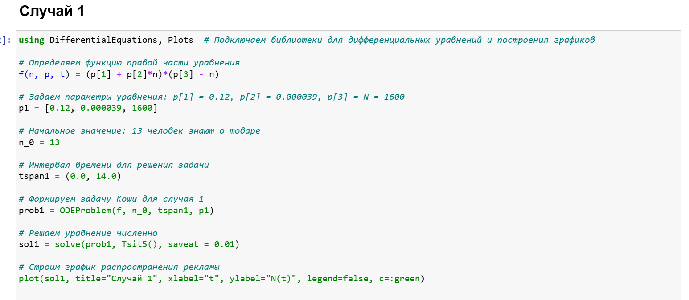
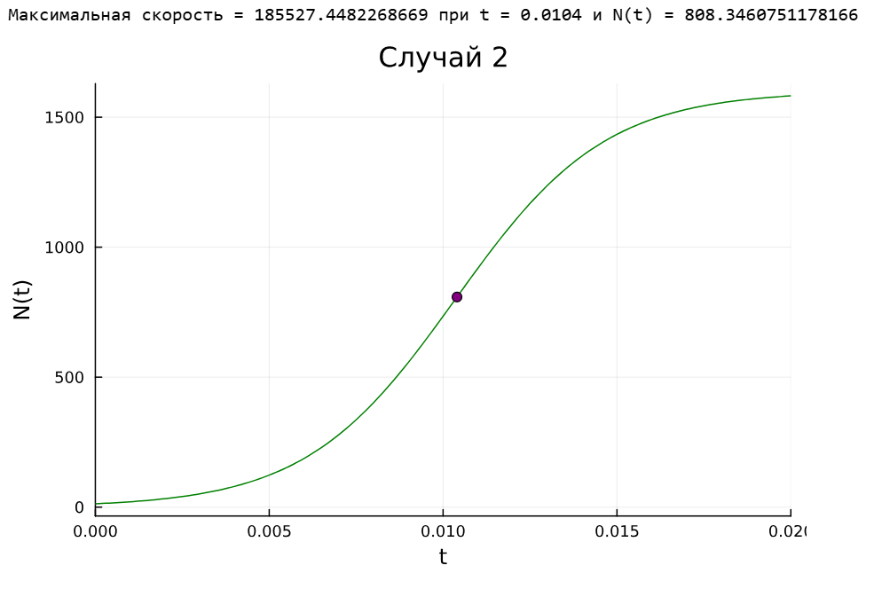
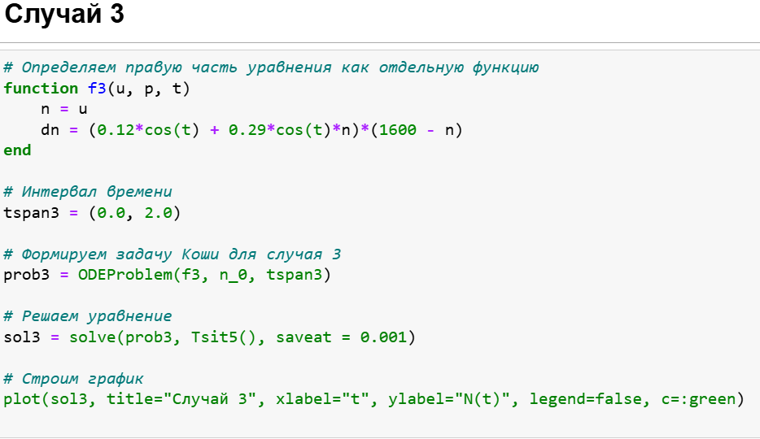
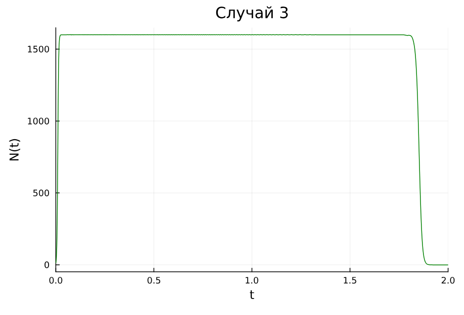

---
## Front matter
title: "Лабораторная работа № 7"
subtitle: "Эффективность рекламы"
author: "Хамдамова Айжана"

## Generic otions
lang: ru-RU
toc-title: "Содержание"

## Bibliography
bibliography: bib/cite.bib
csl: pandoc/csl/gost-r-7-0-5-2008-numeric.csl

## Pdf output format
toc: true # Table of contents
toc-depth: 2
lof: true # List of figures
lot: true # List of tables
fontsize: 12pt
linestretch: 1.5
papersize: a4
documentclass: scrreprt
## I18n polyglossia
polyglossia-lang:
  name: russian
  options:
	- spelling=modern
	- babelshorthands=true
polyglossia-otherlangs:
  name: english
## I18n babel
babel-lang: russian
babel-otherlangs: english
## Fonts
mainfont: IBM Plex Serif
romanfont: IBM Plex Serif
sansfont: IBM Plex Sans
monofont: IBM Plex Mono
mathfont: STIX Two Math
mainfontoptions: Ligatures=Common,Ligatures=TeX,Scale=0.94
romanfontoptions: Ligatures=Common,Ligatures=TeX,Scale=0.94
sansfontoptions: Ligatures=Common,Ligatures=TeX,Scale=MatchLowercase,Scale=0.94
monofontoptions: Scale=MatchLowercase,Scale=0.94,FakeStretch=0.9
mathfontoptions:
## Biblatex
biblatex: true
biblio-style: "gost-numeric"
biblatexoptions:
  - parentracker=true
  - backend=biber
  - hyperref=auto
  - language=auto
  - autolang=other*
  - citestyle=gost-numeric
## Pandoc-crossref LaTeX customization
figureTitle: "Рис."
tableTitle: "Таблица"
listingTitle: "Листинг"
lofTitle: "Список иллюстраций"
lotTitle: "Список таблиц"
lolTitle: "Листинги"
## Misc options
indent: true
header-includes:
  - \usepackage{indentfirst}
  - \usepackage{float} # keep figures where there are in the text
  - \floatplacement{figure}{H} # keep figures where there are in the text
---

# Цель работы

Исследовать модель эффективности рекламы. 

# Задание

Построить график распространения рекламы, математическая модель которой описывается
следующим уравнением:

1. $\dfrac{dn}{dt} = (0.12+0.000039n(t))(N-n(t))$

2. $\dfrac{dn}{dt} = (0.000012+0.29n(t))(N-n(t))$

3. $\dfrac{dn}{dt} = (0.12cos(t)+0.29cos(t)n(t))(N-n(t))$

При этом объем аудитории $N = 1600$, в начальный момент о товаре знает 13 человек. Для случая 2 определить в какой момент времени скорость распространения рекламы будет
иметь максимальное значение.

# Теоретическое введение

Пусть некая фирма начинает рекламировать новый товар. Необходимо, чтобы прибыль от будущих продаж покрывала издержки на дорогостоящую кампанию. Ясно, что вначале расходы могут превышать прибыль, поскольку лишь малая часть потенциальных покупателей будет информирована о новом товаре. Затем, при увеличении числа продаж, уже возможно рассчитывать на заметную прибыль, и, наконец, наступит момент, когда рынок насытится, и рекламировать товар далее станет бессмысленно.

Модель рекламной кампании основывается на следующих основных предположениях. Считается, что величина $\dfrac{dN}{dt}$ — скорость изменения со временем числа потребителей, узнавших о товаре и готовых купить его ($t$ — время, прошедшее с начала рекламной кампании, $N(t)$ – число уже информированных клиентов), — пропорциональна числу покупателей, еще не знающих о нем, т. е. величине $\alpha_1(t)(N_0 - N(t))$, где $N_0$ - общее число покупателей (емкость рынка),характеризует интенсивность рекламной кампании. Предполагается также, что узнавшие о товаре потребители распространяют полученную информацию среди неосведомленных, выступая как бы в роли дополнительных рекламных агентов фирмы. Их вклад равен величине $\alpha_2(t)N(t)(N_0-N(t))$, которая тем больше, чем больше число агентов. Величина $\alpha_2$ характеризует степень общения покупателей между собой [@stud].

В итоге получаем уравнение

$$\dfrac{dn}{dt} = (\alpha_1+\alpha_2 n(t))(N-n(t))$$

# Выполнение лабораторной работы

Подключаем нужные библиотеки для решения ДУ и для отрисовки графиков. Задаем само дифференциальное уравнение, а также начальные условия и параметры. Определяем `ODEProblem`.
Когда задача определена, можем ее решить методом `solve()` и нарисовать график с помощью `plot()`.(рис. [-@fig:004])

{#fig:004 width=70%}

В результате получаем следующий график (рис. [-@fig:001]). Поскольку у нас $\alpha_1 >> \alpha_2$ мы получили модель Мальтуса. Видно, что когда значение покупателей становится 1230 - рынок насытился, и дальше реклама бесполезна.

{#fig:001 width=70%}

Теперь решим ДУ для второго случая и построим график.(рис. [-@fig:005])

Нам требуется найти момент времени, в который скорость распространения рекламы имеет максимальное значение. Первая производная - показатель скорости, поэтому нам просто надо найти максимальное значение $\dfrac{dn}{dt}$ на заданном промежутке времени. 

Для начала просто вычислим все производные на $t\in[0, 0.2]$ с шагом 0.0001, получим вектор значений. С помощью команды `maximum()` найдем максимальный элемент из этого вектора:

Поскольку шаг и интервал времени, на котором мы вычисляли производные, равны шагу и интервалу времени, на котором мы решали ДУ, то индексы в векторе `dev` совпадают с индексами в векторе `sol.t` и `sol.u`. То есть мы можем найти момент времени и значение N(t), когда скорость распространения рекламы максимальна. Для наглядности отразим это на графике (рис. [-@fig:002]).

{#fig:005 width=70%}

Получаем график, который является логистической кривой, поскольку $\alpha_1 << \alpha_2$.

{#fig:002 width=70%}

Для случая 3 задание ДУ и его решение выглядит так:(рис. [-@fig:006])

{#fig:006 width=70%}

В результате получаем следующий график (рис. [-@fig:003]).

{#fig:003 width=70%}

# Выводы

В результате выполнения данной лабораторной работы была исследована модель эффективности рекламы.