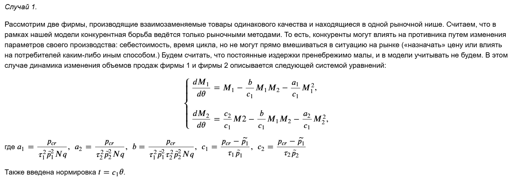
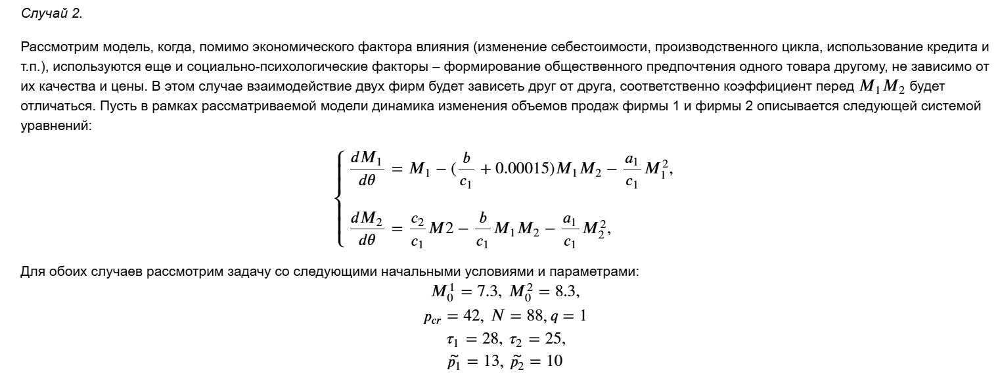
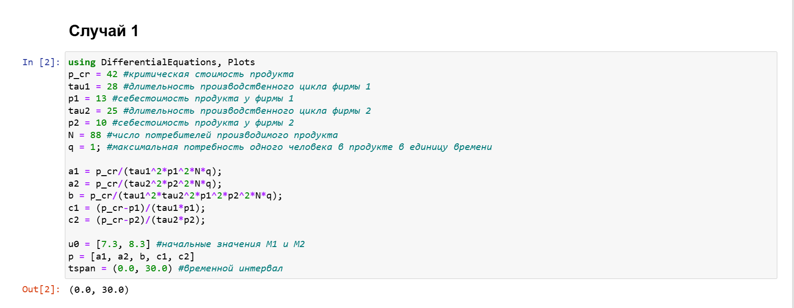
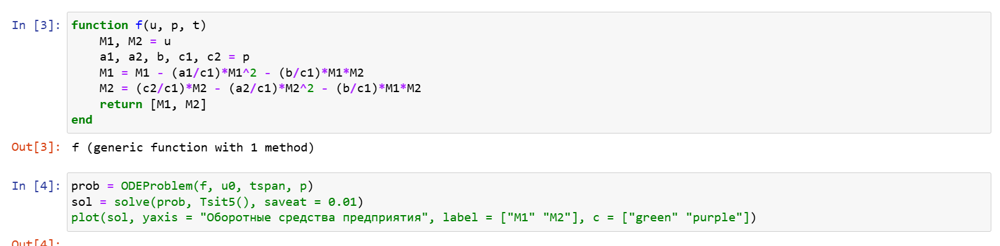
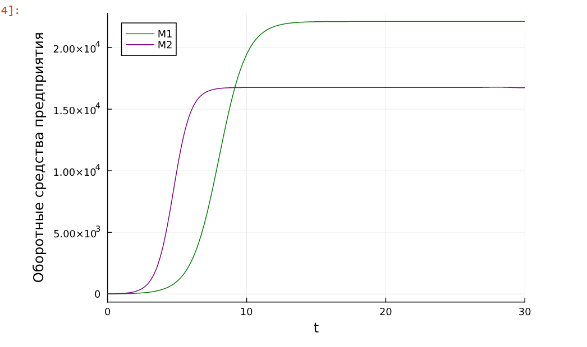
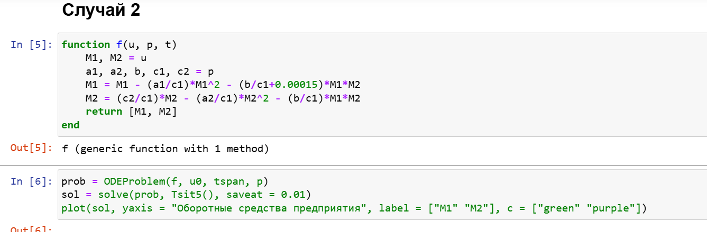
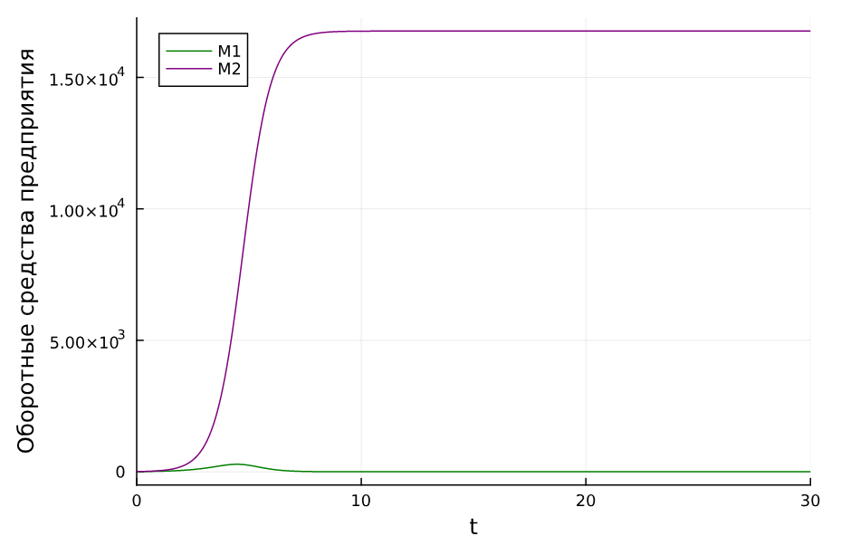

---
## Front matter
lang: ru-RU
title: Лабораторная работа № 8
subtitle: Модель конкуренции двух фирм
author:
  - Хамдамова Айжана
institute:
  - Российский университет дружбы народов, Москва, Россия
date: 14 апреля 2025

## i18n babel
babel-lang: russian
babel-otherlangs: english

## Formatting pdf
toc: false
toc-title: Содержание
slide_level: 2
aspectratio: 169
section-titles: true
theme: metropolis
header-includes:
 - \metroset{progressbar=frametitle,sectionpage=progressbar,numbering=fraction}
---

# Информация

## Докладчик

* Хамдамова Айжана
* студент факультета Физико-математических и естественных наук
* Российский университет дружбы народов
* 1032225989@pfur.ru
* https://github.com/AizhanaKhamdamova/study_2024-2025_mathmod

# Вводная часть

## Теоретическое введение
Математическому моделированию процессов конкуренции и сотрудничества двух фирм на различных рынках посвящено довольно много научных работ, в основном использующих аппарат теории игр и статистических решений. В качестве примера можно привести работы таких исследователей, как Курно, Стакельберг, Бертран, Нэш, Парето [@model].

Следует отметить, что динамические дифференциальные модели уже давно и успешно используются для математического моделирования самых разнообразных по своей природе процессов. Достаточно упомянуть широко использующуюся в экологии модель «хищник-жертва» Вольтерра, математическую теорию развития эпидемий, модели боевых действий

Задача решалась в следующей постановке.

На рынке однородного товара присутствуют две основные фирмы, разделяющие его между собой, т.е. имеет место классическая дуополия.

## Теоретическое введение
Безусловно, это является весьма сильным предположением, однако оно вполне оправдано в тех случаях, когда доля продаж остальных конкурентов на рассматриваемом сегменте рынке пренебрежимо мала. Хорошим примером может служить отечественный рынок микропроцессоров, который по существу разделили между собой две фирмы: Intel и AMD. 

Изменение объемов продаж конкурирующих фирм с течением времени описывается следующей системой дифференциальных уравнений:

$$\begin{cases}
\frac{d M_1}{d \theta} = M_1 - \dfrac{b}{c_1} M_1 M_2 - \dfrac{a_1}{c_1} M_1^2,\\
\frac{d M_2}{d \theta} = \dfrac{c_2}{c_1} M_1 - \dfrac{b}{c_1} M_1 M_2 - \dfrac{a_2}{c_1} M_2^2,
\end{cases}$$

- $N$ -- число потребителей производимого продукта.
- $\tau$ -- длительность производственного цикла
- $p$ -- рыночная цена товара
- $\tilde p$ -- себестоимость продукта, то есть переменные издержки на производство единицы продукции.
- $q$ -- максимальная потребность одного человека в продукте в единицу времени 
- $\theta = \dfrac{t}{c_1}$ -- безразмерное время

## Выполнение лабораторной работы
Для реализации на языке программирования Julia будем использовать библиотеки `DifferentialEquations.jl` для решения дифференциальных уравнений и `Plots.jl` для отрисовки графиков.

Параметры и начальные условия для обоих случаев нашей задачи одинаковы, так что зададим их

## Случай 1.

## Случай 2

## Обозначения:

## Ход работы 

{#fig:005 width=70%}

## Ход работы 

{#fig:005 width=70%}

## Ход работы 

{#fig:005 width=70%}

## Ход работы 

{#fig:005 width=70%}

## Ход работы 

{#fig:005 width=70%}

## Выводы

В результате выполнения данной лабораторной работы я исследовала модели двух конкурирующих фирм 
