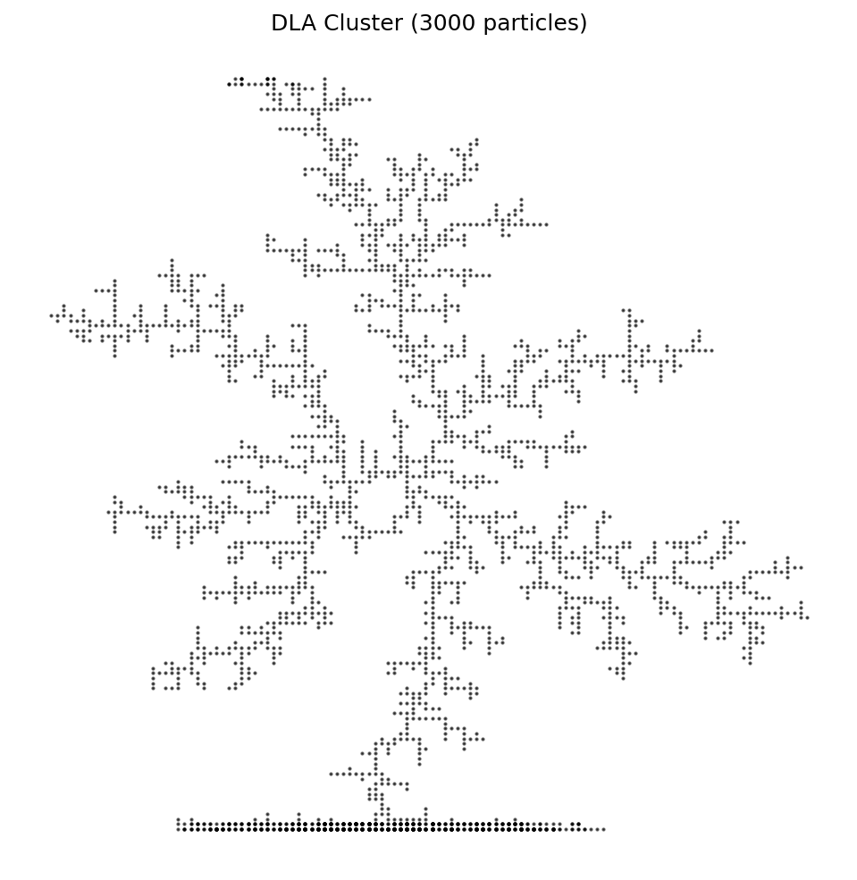
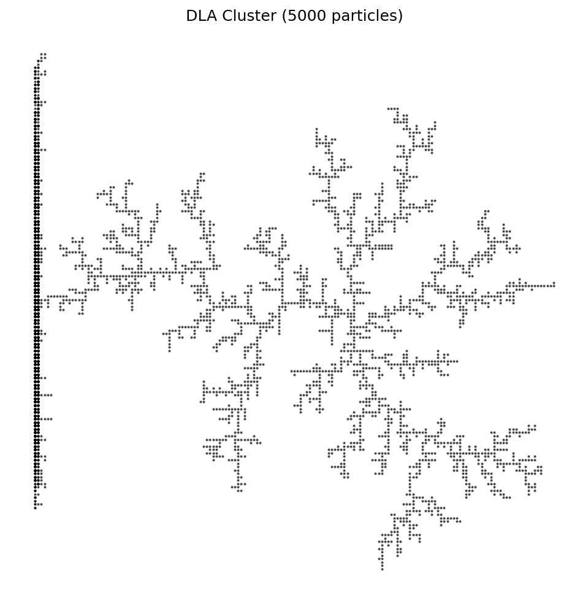
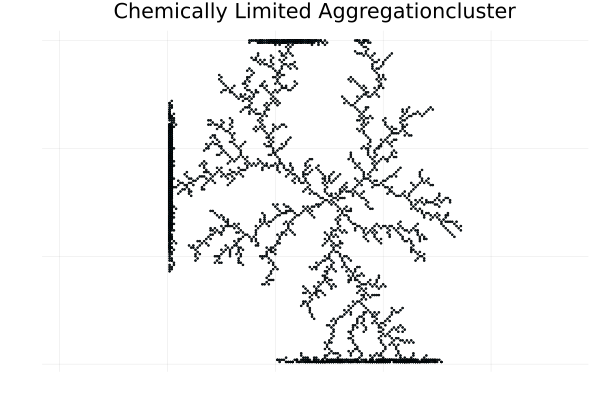
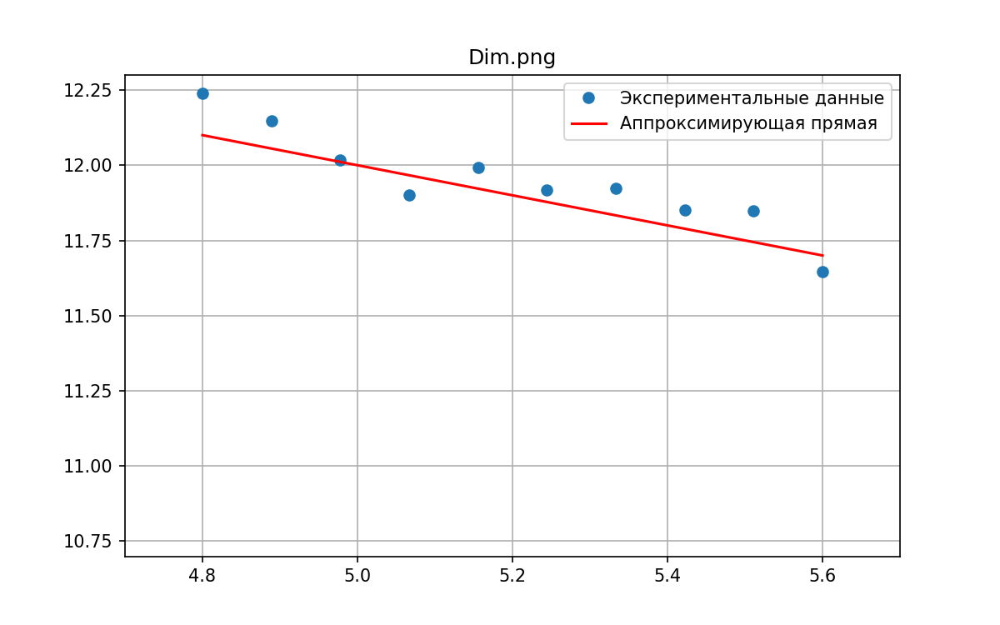

---
## Front matter
title: "Проект. Неравновесная агрегация, фрактальные кластеры"
subtitle: "Этап № 4"
author: "**НФИбд-01-22:**  Ощепков Дмитрий,Хамдамова Айжана,Козлов Всеволод, Алади Принц
  "

## Generic otions
lang: ru-RU
toc-title: "Содержание"

## Bibliography
bibliography: bib/cite.bib
csl: pandoc/csl/gost-r-7-0-5-2008-numeric.csl

## Pdf output format
toc: true # Table of contents
toc-depth: 2
lof: true # List of figures
lot: true # List of tables
fontsize: 12pt
linestretch: 1.5
papersize: a4
documentclass: scrreprt
## I18n polyglossia
polyglossia-lang:
  name: russian
  options:
	- spelling=modern
	- babelshorthands=true
polyglossia-otherlangs:
  name: english
## I18n babel
babel-lang: russian
babel-otherlangs: english
## Fonts
mainfont: IBM Plex Serif
romanfont: IBM Plex Serif
sansfont: IBM Plex Sans
monofont: IBM Plex Mono
mathfont: STIX Two Math
mainfontoptions: Ligatures=Common,Ligatures=TeX,Scale=0.94
romanfontoptions: Ligatures=Common,Ligatures=TeX,Scale=0.94
sansfontoptions: Ligatures=Common,Ligatures=TeX,Scale=MatchLowercase,Scale=0.94
monofontoptions: Scale=MatchLowercase,Scale=0.94,FakeStretch=0.9
mathfontoptions:
## Biblatex
biblatex: true
biblio-style: "gost-numeric"
biblatexoptions:
  - parentracker=true
  - backend=biber
  - hyperref=auto
  - language=auto
  - autolang=other*
  - citestyle=gost-numeric
## Pandoc-crossref LaTeX customization
figureTitle: "Рис."
tableTitle: "Таблица"
listingTitle: "Листинг"
lofTitle: "Список иллюстраций"
lotTitle: "Список таблиц"
lolTitle: "Листинги"
## Misc options
indent: true
header-includes:
  - \usepackage{indentfirst}
  - \usepackage{float} # keep figures where there are in the text
  - \floatplacement{figure}{H} # keep figures where there are in the text
---

# Вводная часть

## Актуальность

Существуют разнообразные физические процессы, основная черта которых --- неравновесная агрегация:

- образование частиц сажи
- выращивание кристаллов соли
- распространение воды в нефти


# **Цель работы**

Исследовать модель агрегации, ограниченной диффузией(DLA).

**Задачи**

- Построить модель агрегации, ограниченной диффузией
- Найти размерность, получившихся кластеров
- Построить график зависимости числа частиц в кластере от радиуса гирации

## Объект и предмет исследования

- Модель DLA, BA, CLA, CCA
- Фрактальная размерность
- График зависимости числа частиц в кластере от радиуса гирации

## Материалы и методы

- Язык программирования Julia

# Теоретическое описание задачи

## Фрактальная размерность

$$
d = \lim_{\epsilon \rightarrow 0}(\dfrac{ln(N(\epsilon))}{ln(\dfrac{1}{\epsilon})})
$$

$$
ln(N(\epsilon)) = D ln(R) + b,
$$

где $D$ – фрактальная размерность, $N(\epsilon)$ – число частиц на расстоянии меньшем чем $R$, $R$ – радиус.

# Агрегация, ограниченная диффузией

**Агрегация, ограниченная диффузией (diffusion-limited aggregation, DLA)** --- первая модель агрегации, представляющая собой шумный рост, ограниченный диффузией.

# Практическая реализация

## Описание алгоритма 

{#fig:001 width=27%}

## Случайное блуждане

Обозначим $v^u = (0,1)$ , $v^d = (0,-1)$, $v^r = (1,0)$, $v^l = (-1,0)$ - шаг на 1 вверх, вниз, влево, вправо соответственно.

$\{S_n\}$ -- ряд, описывающий случайное блуждание, $* = u, d, r, l$, $n$ -- количество шагов

$$
S_n = \sum^n_{i=1}{v_n^*}, 
$$

$$
P(v_{i+1} = v_n^*) = \dfrac{1}{4}
$$


## DLA кластер(Diffusion-Limited Aggregation)

``` julia
using Plots
using Random
using ColorSchemes


# --------------------------------------------
# Diffusion-Limited Aggregation (DLA)
# --------------------------------------------
mutable struct DLACluster
    size::Int
    target::Int
    grid::Matrix{Int}
    particles::Vector{Tuple{Int,Int}}
end

function DLACluster(size=100, target=500)
    grid = zeros(Int, size, size)
    mid = size ÷ 2
    grid[mid, mid] = 1
    DLACluster(size, target, grid, [(mid, mid)])
end

function simulate!(dla::DLACluster)
    directions = [(1,0), (-1,0), (0,1), (0,-1)]
    while length(dla.particles) < dla.target
        edge = rand(["top", "bottom", "left", "right"])
        x, y = start_position(dla.size, edge)
        
        while true
            dx, dy = rand(directions)
            x += dx
            y += dy
            
            if !check_bounds(dla.size, x, y)
                break
            end
            
            if check_neighbors(dla.grid, x, y)
                dla.grid[x, y] = 1
                push!(dla.particles, (x, y))
                break
            end
        end
    end
end

function plot_dla(dla::DLACluster; filename="DLA_julia.png")
    x = [p[1] for p in dla.particles]
    y = [p[2] for p in dla.particles]
    
    plt = scatter(y, x, 
        markersize=1,
        color=:viridis,
        legend=false,
        axis=false,
        grid=false,
        title="DLA Cluster (Julia)",
        aspect_ratio=1
    )
    savefig(plt, filename)
end

# Вспомогательные функции
function start_position(size, edge)
    if edge == "top"
        (rand(1:size), 1)
    elseif edge == "bottom"
        (rand(1:size), size)
    elseif edge == "left"
        (1, rand(1:size))
    else
        (size, rand(1:size))
    end
end

check_bounds(size, x, y) = 1 ≤ x ≤ size && 1 ≤ y ≤ size

function check_neighbors(grid, x, y)
    for dx in -1:1, dy in -1:1
        (dx == 0 && dy == 0) && continue
        nx, ny = x + dx, y + dy
        1 ≤ nx ≤ size(grid, 1) && 1 ≤ ny ≤ size(grid, 2) && grid[nx, ny] == 1 && return true
    end
    false
end

# Запуск
Random.seed!(42)
dla = DLACluster(150, 3000)
simulate!(dla)
plot_dla(dla)

```

## DLA кластер(Diffusion-Limited Aggregation)

:::::::::::::: {.columns align=center}
::: {.column width="50%"}

{#fig:002 width=100%}

:::
::: {.column width="50%"}

{#fig:003 width=100%}

:::
::::::::::::::


## BA(Ballistic Aggregation)

``` julia
using Plots
using Random
using ColorSchemes

# =============================================
# Ballistic Aggregation (BA)
# =============================================
mutable struct BACluster
    size::Int
    target::Int
    grid::Matrix{Int}
    particles::Vector{Tuple{Int,Int}}
end

function BACluster(size=100, target=500)
    grid = zeros(Int, size, size)
    mid = size ÷ 2
    grid[mid, mid] = 1
    BACluster(size, target, grid, [(mid, mid)])
end

function simulate!(ba::BACluster)
    while length(ba.particles) < ba.target
        x, y = rand_start_position(ba.size)
        prev = (x, y)
        
        while check_bounds(ba.size, x, y)
            dx = sign(ba.size÷2 - x)
            dy = sign(ba.size÷2 - y)
            x += dx
            y += dy
            
            if check_neighbors(ba.grid, x, y)
                ba.grid[prev...] = 1
                push!(ba.particles, prev)
                break
            end
            prev = (x, y)
        end
    end
end

function plot_ba(ba::BACluster; filename="BA_julia.png")
    x = [p[1] for p in ba.particles]
    y = [p[2] for p in ba.particles]
    
    plt = scatter(y, x,
        markersize = 1.5,
        color = :blues,
        legend = false,
        axis = false,
        title = "Ballistic Aggregation",
        aspect_ratio = 1
    )
    savefig(plt, filename)
end

```


## BA(Ballistic Aggregation)

{#fig:002 width=100%}


## CLA кластер
``` julia
mutable struct CLACluster
    size::Int
    target::Int
    grid::Matrix{Int}
    particles::Vector{Tuple{Int,Int}}
end

function CLACluster(size=100, target=500)
    grid = zeros(Int, size, size)
    mid = size ÷ 2
    grid[mid, mid] = 1
    CLACluster(size, target, grid, [(mid, mid)])
end

function simulate!(cla::CLACluster)
    directions = [(-1,0), (1,0), (0,-1), (0,1)]
    
    while length(cla.particles) < cla.target
        # Старт с случайной позиции на границе
        edge = rand(["top", "bottom", "left", "right"])
        x, y = start_position(cla.size, edge)
        
        while true
            dx, dy = rand(directions)
            x += dx
            y += dy
            
            if !check_bounds(cla.size, x, y)
                break
            end
            
            if check_neighbors(cla.grid, x, y)
                cla.grid[x, y] = 1
                push!(cla.particles, (x, y))
                break
            end
        end
    end
end

```

## CLA кластер(Chemically Limited Aggregationcluster)


{#fig:002 width=100%}


## CCA(Cluster-Cluster Aggregation)

``` julia
# =============================================
# Cluster-Cluster Aggregation (CCA)
# =============================================
mutable struct ClusterCCA
    particles::Vector{Tuple{Int,Int}}
    position::Tuple{Float64,Float64}
    velocity::Tuple{Float64,Float64}
end

struct CCA
    size::Int
    clusters::Vector{ClusterCCA}
end

function CCA(size=100, n_clusters=20)
    clusters = [ClusterCCA(
        [(rand(1:size), rand(1:size))], 
        (rand(1:size), rand(1:size)), 
        (randn(), randn())
    ) for _ in 1:n_clusters]
    CCA(size, clusters)
end

function simulate!(cca::CCA, steps=100)
    for _ in 1:steps
        move_clusters!(cca)
        merge_clusters!(cca)
    end
end

function move_clusters!(cca::CCA)
    for cluster in cca.clusters
        x, y = cluster.position
        vx, vy = cluster.velocity
        x = mod(x + vx, cca.size)
        y = mod(y + vy, cca.size)
        cluster.position = (x, y)
    end
end

function merge_clusters!(cca::CCA)
    merged = Set{Int}()
    new_clusters = ClusterCCA[]
    
    for (i, c1) in enumerate(cca.clusters)
        i in merged && continue
        for (j, c2) in enumerate(cca.clusters[i+1:end])
            dist = hypot(c1.position[1]-c2.position[1], c1.position[2]-c2.position[2])
            if dist < 3.0
                push!(merged, i)
                push!(merged, i+j)
                new_particles = vcat(c1.particles, c2.particles)
                push!(new_clusters, ClusterCCA(
                    new_particles,
                    ((c1.position[1]+c2.position[1])/2, (c1.position[2]+c2.position[2])/2),
                    ((c1.velocity[1]+c2.velocity[1])/2, (c1.velocity[2]+c2.velocity[2])/2)
                ))
            end
        end
        i ∉ merged && push!(new_clusters, c1)
    end
    cca.clusters = new_clusters
end

function plot_cca(cca::CCA; filename="CCA_julia.png")
    plt = plot(legend=false, axis=false, aspect_ratio=1)
    colors = ColorSchemes.rainbow
    
    for (i, cluster) in enumerate(cca.clusters)
        x = [p[1] for p in cluster.particles]
        y = [p[2] for p in cluster.particles]
        scatter!(plt, y, x, 
            markersize=1.2, 
            color=colors[(i % 10)+1]
        )
    end
    savefig(plt, filename)
end


```
## CCA(Cluster-Cluster Aggregation)

{#fig:002 width=100%}

## Фрактальная размерность

При построении 17 моделей с ограничением по радиусу от 130 до 290 получили $D = 1.717$.

{#fig:004 width=60%}

## CLA кластер

<style>
.code-column pre {font-size: 0.55em; line-height: 1.1em; margin-top: 0}
.split-container {display: grid; grid-template-columns: 55% 45%; gap: 15px}
.section-title {margin-bottom: 10px}
</style>

<div class="split-container">

<div>

## Обсуждение результатов

Достигнуты все основные цели: реализованы модели DLA, BA, CLA, CCA, определена фрактальная размерность кластеров DLA, построен зависимый график.

Обсуждены ограничения: дискретизация сетки, статистическая неопределённость при малом числе частиц, конечный радиус симуляции.

Выявлены перспективы: переход к 3D-моделированию агрегатов, анализ влияния взаимодействий между частицами, оптимизация алгоритмов на GPU.

## Самооценка деятельности

Ощепков Дмитрий: разработал и протестировал ядро генерации случайного блуждания, внёс предложения по оптимизации структуры данных.

Хамдамова Айжана: реализовала сбор статистики по радиусу гирации, провела линейную аппроксимацию для оценки фрактальной размерности.

Козлов Всеволод: оформилил блок-схему алгоритма, подготовил скрипты визуализации кластеров.

Алади Принц: организовал интеграцию модулей, подготовил финальные слайды презентации, обеспечил контроль версий.


# Выводы

- Построены модели DLA, BA, CLA, CCA
- Найдена фрактальная размерность, получившихся кластеров DLA
- Построен график зависимости числа частиц в кластере от радиуса гирации DLA

# Список литературы

1. Медведев Д.А. и др. Моделирование физических процессов и явлений на ПК: Учеб. пособие. Новосибирск: Новосиб. гос. ун-т, 2010. 101 с.
2. Sander L.M. Diffusion-limited aggregation: A kinetic critical phenomenon? Contemporary Physics, 2000.